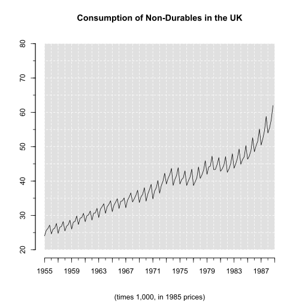

# base-r-plots

This repository contains *R*-functions to generate good looking graphs using base *R*.

## Examples

``

source("base_r_plots_functions.R")

library(AER)

data("UKNonDurables")

UKNonDurables
length(UKNonDurables)
length(seq.Date(from = as.Date("1955-01-01"), to = as.Date("1988-10-01"), by = "1 quarter"))

summary(UKNonDurables)

# inputs
x.axi.tic.01 <- seq.Date(from = as.Date("1955-01-01"), to = as.Date("1989-10-01"), by = "4 quarter")
x.axi.tic.02 <- seq.Date(from = as.Date("1955-01-01"), to = as.Date("1989-10-01"), by = "8 quarter")

y.axi.tic.01 <- seq(from = 20000, to = 80000, by = 5000)
y.axi.tic.02 <- seq(from = 20000, to = 80000, by = 10000)

x.axi.tic.02.lab <- NULL
y.axi.tic.02.lab <- as.character(seq(from = 20000, to = 80000, by = 10000) * 1/1000)

main <- "Consumption of Non-Durables in the UK"
sub <- "(times 1,000, in 1985 prices)"
xlab <- ""
ylab <- ""
x.mar <- 0
y.mar <- 0
par.inp <- NULL

# prepare plot
ts_plot_fun(x.axi.tic.01 = x.axi.tic.01, x.axi.tic.02 = x.axi.tic.02,
            y.axi.tic.01 = y.axi.tic.01, y.axi.tic.02 = y.axi.tic.02,
            x.axi.tic.02.lab = x.axi.tic.02.lab, y.axi.tic.02.lab = y.axi.tic.02.lab,
            main = main, sub = sub, xlab = xlab, ylab = ylab, x.mar = x.mar, y.mar = y.mar,
            par.inp = par.inp)

lines(x = seq.Date(from = as.Date("1955-01-01"), to = as.Date("1988-10-01"), by = "1 quarter"),
      y = c(UKNonDurables),
      type = "l")

``

